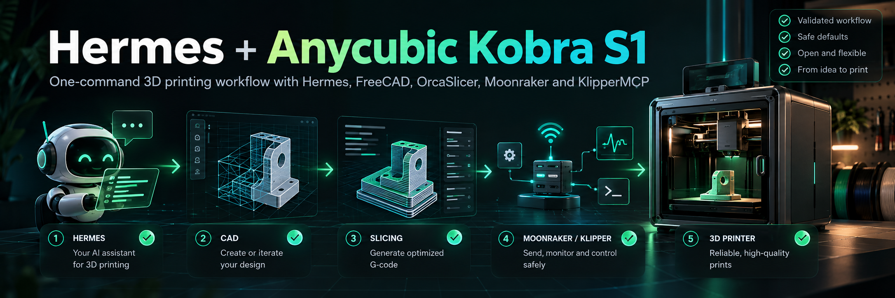
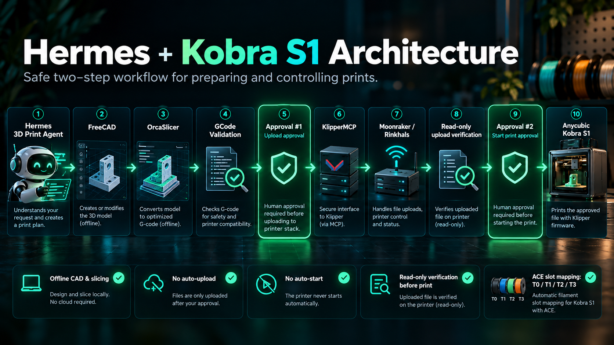
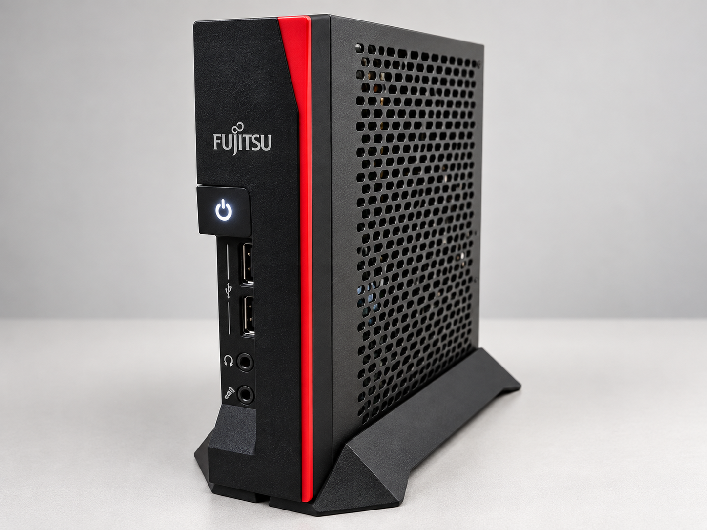

<p align="center">
  
</p>

<div align="center">

# Hermes + Anycubic Kobra S1

**A one-command, approval-gated 3D-printing workflow with Hermes, FreeCAD, OrcaSlicer, Moonraker and KlipperMCP.**

[](https://github.com/PermissionWest9850/hermes-kobra-s1/releases)
[](LICENSE)


[Quick install](#-quick-install) · [Architecture](#-architecture) · [Safety](#-safety-model) · [Test system](#%EF%B8%8F-reference-test-system) · [ACE Pro](#-ace-pro-slot-mapping) · [Troubleshooting](#-troubleshooting)

</div>

---

## ✨ What this project is

This repository prepares a Linux host for a **Hermes-assisted Anycubic Kobra S1 / Kobra S1 Combo workflow**.

It combines:

- ✅ **Hermes Agent** as the workflow interface
- ✅ **FreeCAD** for local CAD/model preparation
- ✅ **OrcaSlicer 2.4.2** for slicing
- ✅ **KlipperMCP** for Moonraker/Klipper integration
- ✅ a Kobra S1-specific KlipperMCP upload patch
- ✅ Kobra S1 OrcaSlicer profile preparation
- ✅ ACE Pro tool mapping
- ✅ read-only Moonraker connectivity checks
- ✅ a two-step approval workflow for upload and print start
- ✅ safe re-runs that preserve existing local configuration

The goal is simple:

> **Make a capable Kobra S1 + Hermes setup approachable without turning the installer into a printer-modification script.**

---

## 🚀 Quick install

> [!IMPORTANT]
> **Rinkhals / Moonraker must already be installed and reachable on the printer.**
> This project does **not** flash firmware, install Rinkhals, or change printer network settings.

On a fresh **Debian 13** host:

```bash
curl -fsSL https://raw.githubusercontent.com/PermissionWest9850/hermes-kobra-s1/main/install.sh | bash
```

The installer guides you through the parts that require your input:

1. system bootstrap
2. Hermes setup/login when no provider is configured yet
3. project directory
4. Kobra S1 Moonraker IP or URL
5. profile preparation
6. final read-only verification

### Prefer to inspect the installer first?

```bash
curl -fsSL \
  https://raw.githubusercontent.com/PermissionWest9850/hermes-kobra-s1/main/install.sh \
  -o install.sh

less install.sh
bash install.sh
```

> [!NOTE]
> On a minimal Debian installation without `sudo`, the installer falls back to `su` for one bundled privileged bootstrap. In clean-VM testing this resulted in **one Debian root-password prompt**. Hermes and all user configuration still run under the normal user account.

---

## 🧩 Architecture

<p align="center">
  
</p>

The supplied workflow is deliberately split into two separate decisions:

```text
Hermes
  ↓
FreeCAD / model preparation
  ↓
OrcaSlicer
  ↓
GCode validation
  ↓
APPROVAL #1 — upload
  ↓
KlipperMCP → Moonraker / Rinkhals → Kobra S1
  ↓
Read-only upload verification
  ↓
APPROVAL #2 — start print
  ↓
Print
```

> [!NOTE]
> The approval gates are part of the supplied Hermes workflow policy. They are not a printer-firmware safety interlock. Always inspect models, slicing settings and GCode before approving real-world printer actions.

---

## 🔒 Safety model

### The installer itself

The installer is intentionally conservative.

- ✅ does **not** install or modify Rinkhals
- ✅ does **not** flash printer firmware
- ✅ does **not** change printer network settings
- ✅ does **not** upload GCode
- ✅ does **not** start a print
- ✅ checks Moonraker through read-only `/server/info`
- ✅ refuses to run the complete installation as `root`
- ✅ keeps Hermes and user configuration under the normal user account
- ✅ creates the local profile `.env` with restricted permissions
- ✅ keeps an existing `.env` unchanged
- ✅ does not silently overwrite existing Orca profiles

### During normal Hermes use

The supplied workflow policy requires:

1. GCode validation / inspection
2. **explicit approval #1** before upload
3. read-only verification after upload
4. **explicit approval #2** before print start

An approval to upload a file is therefore **not** treated as permission to start the print.

---

## ✅ Clean-VM tested

The v0.2.0 release candidate was tested end-to-end on a fresh **Debian 13 (Trixie)** VM.

| Test | Result |
|---|---:|
| Fresh Debian 13 minimal installation | ✅ |
| Bundled privileged bootstrap | ✅ |
| Root-password prompts on tested minimal Debian | ✅ 1× |
| Debian Node.js ≥ 20 | ✅ |
| Hermes installation | ✅ |
| Hermes OpenAI Codex login path | ✅ |
| KlipperMCP checkout + Kobra patch | ✅ |
| TypeScript build | ✅ |
| FreeCAD | ✅ |
| OrcaSlicer 2.4.2 | ✅ |
| Kobra S1 Orca profile generation | ✅ |
| Moonraker read-only check | ✅ |
| Second installer run / idempotency | ✅ |
| Existing `.env` preserved on re-run | ✅ |
| Existing Orca profiles preserved on re-run | ✅ |
| Automatic GCode upload during install | ❌ intentionally not performed |
| Automatic print start during install | ❌ intentionally not performed |

---

### ✅ Real printer connection verified

The read-only end-to-end connection was successfully verified against a real
**Anycubic Kobra S1 Combo with ACE Pro**:

`Hermes → KlipperMCP → Moonraker → Rinkhals → Kobra S1 → ACE Pro`

The live test confirmed:

- ✅ printer state reported as `ready`
- ✅ print state reported as `standby`
- ✅ nozzle and bed status readable
- ✅ ACE Pro detected as `ACE 1`
- ✅ all 4 ACE gates detected
- ✅ `T0 / T1 / T2 / T3` tool mapping readable
- ✅ Hermes successfully retrieved the real printer and ACE status through KlipperMCP
- ✅ no GCode was uploaded
- ✅ no print was started
- ✅ no printer configuration was changed

This verification was intentionally limited to read-only operations.

---

## 🖥️ Reference test system

<p align="center">
  
</p>

<p align="center">
  <em>Reference hardware used for development and clean-VM validation: Fujitsu S740 thin client.</em>
</p>

The project was developed and validated on a real, low-power home-lab setup rather than requiring a high-end workstation.

| Component | Reference environment |
|---|---|
| **Host hardware** | Fujitsu S740 thin client |
| **Virtualization** | Proxmox |
| **Guest OS** | Debian 13 (Trixie) VM |
| **Agent runtime** | Hermes Agent |
| **CAD** | FreeCAD |
| **Slicer** | OrcaSlicer |
| **Printer integration** | KlipperMCP + Moonraker / Rinkhals |
| **Printer** | Anycubic Kobra S1 Combo |

> [!NOTE]
> The Fujitsu S740 is the **reference test system, not a hardware requirement**. The project is intended for other compatible Debian-based Linux systems as well.

---

## 📦 What the installer prepares

### System packages

Using the normal Debian repositories where possible:

- `curl`
- `git`
- Python tooling
- archive utilities
- `jq`
- GnuPG
- FreeCAD
- FUSE support
- Debian `nodejs` / `npm`

Node is checked to ensure **Node.js 20 or newer** is available.

### User-level components

Installed or configured for the normal user:

- Hermes Agent
- KlipperMCP
- the Kobra S1 KlipperMCP patch
- OrcaSlicer 2.4.2
- Hermes profile `kobra-s1-3d-print`
- local project directory
- local profile `.env`
- OrcaSlicer machine/process/filament profiles
- `kobra3d` convenience launcher

A new OrcaSlicer installation is stored under:

```text
~/.local/opt/orcaslicer/
```

An existing complete `/opt/orcaslicer` installation may be detected and reused read-only, but the installer does not silently create a new system-wide `/opt` installation.

---

## 🖨️ OrcaSlicer profile preparation

The profile helper prepares a Kobra S1 workflow with:

- `T[initial_tool]` in machine start GCode
- multi-bed-type support enabled
- Textured PEI as the configured bed type
- Kobra S1 machine profile
- standard 0.20 mm process profile
- PLA filament profile

Example output structure:

```text
3d-print/
├── Druckprofile/
│   ├── Anycubic Kobra S1 0.4 nozzle.json
│   └── 0.20mm Standard @Anycubic Kobra S1 0.4 nozzle.json
└── Filamente/
    └── Anycubic PLA @Anycubic Kobra S1 0.4 nozzle.json
```

### Safe re-runs

If all three expected profiles already exist:

```text
Existing Orca profiles kept unchanged.
```

If only part of the set exists, the installer stops instead of silently regenerating or overwriting files.

---

## 🎨 ACE Pro slot mapping

The tested Kobra S1 Combo exposes one ACE unit with four gates.

| ACE Pro slot | Klipper tool | Verification status |
|---:|:---:|---|
| Slot 1 | `T0` | ✅ recognized and practically verified with PLA |
| Slot 2 | `T1` | ✅ recognized; empty during verification |
| Slot 3 | `T2` | ✅ recognized; empty during verification |
| Slot 4 | `T3` | ✅ recognized; empty during verification |

> [!NOTE]
> `T0` is **not** a universal requirement for every job. The prepared machine start GCode uses `T[initial_tool]`, allowing OrcaSlicer to select the configured initial tool.

---

## 🤖 Start Hermes

After installation:

```bash
hermes -p kobra-s1-3d-print chat
```

Or, when `~/.local/bin` is on your `PATH`:

```bash
kobra3d
```

---

## 🔁 Re-running the installer

Re-running the installer is supported and was tested.

A normal second run should:

- reuse the existing Hermes provider/model configuration
- reuse the existing KlipperMCP checkout
- recognize an already-applied patch
- reuse FreeCAD
- reuse OrcaSlicer
- keep the existing `.env`
- keep existing Orca profiles unchanged
- reuse the saved project directory
- reuse the saved Moonraker URL
- repeat the read-only Moonraker connectivity check

Typical messages:

```text
Existing Hermes configuration found; keeping current provider/model.
Existing Kobra profile configuration found; keeping .env unchanged.
Existing Orca profiles kept unchanged.
```

---

## 🌐 Moonraker / Rinkhals prerequisite

This project assumes that the Kobra S1 already exposes Moonraker through an existing Rinkhals setup.

Example:

```text
http://PRINTER_IP:7125
```

The installer tests only the read-only endpoint:

```text
/server/info
```

If Moonraker is unreachable, the installer does not attempt to repair or reconfigure the printer.

---

## ⚙️ KlipperMCP notes

This project uses a tested KlipperMCP revision plus:

```text
patches/klippermcp-kobra-upload.patch
```

The patch adds a dedicated GCode upload tool with conservative behavior:

- `.gcode` files only
- absolute local source path
- plain remote filename
- refuses an already-existing remote filename during the pre-check
- upload only
- **does not start the print**

> [!NOTE]
> The remote no-overwrite test is a pre-check, not an atomic filesystem guarantee.

### npm audit

The tested KlipperMCP dependency tree currently reports transitive npm audit advisories.

The installer intentionally does **not** run:

```bash
npm audit fix
```

automatically. Silently changing the dependency tree would make the tested revision less reproducible.

---

## 📥 OrcaSlicer download verification

The installer selects the official **OrcaSlicer 2.4.2** AppImage from the upstream GitHub release.

When an upstream `SHA256SUMS` release asset is unavailable, the installer prints a warning and continues with the HTTPS-protected GitHub download.

This residual supply-chain limitation is documented rather than hidden.

---

## 🔐 Secrets and privacy

The public repository is designed to contain **no personal credentials**.

Do not commit:

- real `.env` files
- API keys
- GitHub tokens
- Hermes authentication data
- Wi-Fi credentials
- private printer credentials
- Hermes sessions or memories

The real profile `.env` is created locally and should remain local.

Public examples use placeholders such as:

```text
PRINTER_IP
```

instead of publishing private LAN addresses.

---

## 🧱 Repository layout

```text
.
├── .env.EXAMPLE
├── .gitignore
├── LICENSE
├── README.md
├── SOUL.md
├── config.yaml
├── distribution.yaml
├── install.sh
├── assets/
│   ├── hermes-kobra-s1-hero.png
│   └── hermes-kobra-s1-architecture.png
├── patches/
│   └── klippermcp-kobra-upload.patch
└── scripts/
    ├── build_offline.py
    ├── build_print.py
    ├── fcad_to_stl.py
    └── prepare_orca_profiles.py
```

| File | Purpose |
|---|---|
| `install.sh` | one-command installer |
| `SOUL.md` | Hermes workflow and safety policy |
| `config.yaml` | Hermes profile configuration |
| `distribution.yaml` | Hermes distribution/profile manifest |
| `.env.EXAMPLE` | public environment-variable reference |
| `prepare_orca_profiles.py` | safe Orca profile preparation |
| `klippermcp-kobra-upload.patch` | tested GCode upload extension |

---

## 🛠️ Troubleshooting

### `sudo` is not installed

This is common on minimal Debian installations.

If `sudo` is unavailable but `su` is present, the installer uses one bundled privileged bootstrap. The root password is handled by `su` itself and is not stored by the installer.

### Moonraker is not reachable

Check that:

- the printer is powered on
- Rinkhals is running
- Moonraker is reachable from the Debian host
- the configured IP / URL is correct
- TCP port `7125` is reachable

Manual read-only test:

```bash
curl http://PRINTER_IP:7125/server/info
```

### OrcaSlicer checksum warning

A warning similar to:

```text
WARNING: No upstream SHA256SUMS asset found for OrcaSlicer 2.4.2
```

does not mean that the AppImage download itself failed. The installer continues using the official GitHub HTTPS download.

### Existing Orca profiles

The installer never silently overwrites them.

- complete expected set → kept unchanged
- incomplete set → installer stops for manual resolution

### Existing KlipperMCP checkout

The installer reuses the expected checkout and recognizes an already-applied patch. It does not silently update an unexpected revision.

---


## 🔧 Advanced / Technical Reference

> This section contains the deeper manual and technical workflow documentation.


The simple installation path above is recommended for new users. The sections below preserve the detailed reference setup, internal architecture, safety model and manual commands.


A reproducible Hermes Agent setup for preparing and safely controlling 3D prints on an Anycubic Kobra S1 through Rinkhals, Moonraker and KlipperMCP.

### Install Hermes

Official Linux installer:

```bash
curl -fsSL https://hermes-agent.nousresearch.com/install.sh | bash
```

Reload the shell:

```bash
source ~/.bashrc
```

Configure Hermes:

```bash
hermes setup
```

The reference profile was tested with `openai-codex` and `gpt-5.5`. Other compatible Hermes-supported models may also work.

### Install the Kobra S1 profile

After this repository is published, replace `PermissionWest9850` with the actual GitHub account:

```bash
REPO_URL="https://github.com/PermissionWest9850/hermes-kobra-s1.git"
hermes profile install "$REPO_URL" --alias
```

The profile name is:

```text
kobra-s1-3d-print
```

### Configure the profile

Hermes generates `.env.EXAMPLE` during installation.

Create the local environment file:

```bash
cd ~/.hermes/profiles/kobra-s1-3d-print
cp .env.EXAMPLE .env
nano .env
```

Required values:

```dotenv
KOBRA_S1_MOONRAKER_URL=http://PRINTER_IP:7125
KLIPPER_MCP_PATH=/home/YOUR_USER/KlipperMCP
PROJECT_DIR=/home/YOUR_USER/3d-print
```

Never commit the real `.env` file.

### Offline FreeCAD pipeline

Included scripts:

```text
scripts/build_offline.py
scripts/build_print.py
scripts/fcad_to_stl.py
```

Pipeline:

```text
.FCStd
  |
  v
build_offline.py
  |
  v
build_print.py
  |
  v
FreeCADCmd
  |
  v
temporary STL
  |
  v
OrcaSlicer
  |
  v
GCode
  |
  v
local Markdown print history
```

The supplied wrapper pipeline currently accepts `.FCStd` files.

The local build refuses to silently overwrite an existing GCode file.

### OrcaSlicer reference profiles

The tested setup uses the OrcaSlicer 2.4.2 Kobra S1 system profiles with a few local changes.

Machine profile:

```text
Anycubic Kobra S1 0.4 nozzle
```

Reference start GCode:

```text
G9111 bedTemp=[first_layer_bed_temperature] extruderTemp=[first_layer_temperature[initial_tool]]
M117
T[initial_tool]
```

Additional tested machine settings:

```text
support_multi_bed_types = 1
default_bed_type = 4
```

PLA profile:

```text
Anycubic PLA @Anycubic Kobra S1 0.4 nozzle
```

The tested profile uses:

```text
bed_type = Textured PEI Plate
```

The tested 0.20 mm process profile is unchanged from the OrcaSlicer 2.4.2 system profile.

### Generate the tested profiles

The repository includes `scripts/prepare_orca_profiles.py`.

Example:

```bash
export PROJECT_DIR="$HOME/3d-print"
~/.hermes/profiles/kobra-s1-3d-print/scripts/prepare_orca_profiles.py
```

The script refuses to overwrite existing destination profiles.

### Headless slicing

The reference workflow explicitly sets:

```text
--curr-bed-type "Textured PEI Plate"
```

This prevents another plate type from being silently inherited from profile or 3MF metadata.

### Reference PLA values

```text
Nozzle:
  normal:       205 °C
  first layer:  215 °C

Textured PEI:
  normal:        55 °C
  first layer:   55 °C
```

### GCode validation

Before upload, inspect the generated GCode.

For the reference PLA / ACE setup, verify in particular:

```text
curr_bed_type = Textured PEI Plate
first_layer_bed_temperature = 55
textured_plate_temp_initial_layer = 55
```

Example start sequence when ACE Slot 1 is selected:

```text
G9111 bedTemp=55 extruderTemp=215
M117
T0
```

The actual nozzle temperature must always match the filament being used.

The printer reports four ACE slots with the mapping Slot 1 -> `T0`, Slot 2 -> `T1`, Slot 3 -> `T2`, Slot 4 -> `T3`. Slot 1 is practically verified with PLA. Slots 2-4 were recognized but empty during documentation, so their mapping is system-confirmed but not yet filament-tested. Do not assume `T0` for every print.

Also inspect for unexpected printer-specific start commands or macros inherited from another printer profile.

### Foreign 3MF files

3MF files may contain more than geometry. They can embed:

- printer settings
- filament settings
- plate type
- process settings
- start GCode
- printer-specific commands

Do not blindly reuse these embedded settings.

Geometry and useful placement information may be reused, but the final slice should normally use the tested local Kobra S1 profiles unless explicitly requested otherwise.

For example, an embedded:

```text
curr_bed_type = High Temp Plate
```

should not silently replace the local Textured PEI configuration.

### Install KlipperMCP

Clone the tested KlipperMCP revision:

```bash
cd ~
git clone https://github.com/mikehatch/KlipperMCP.git
cd KlipperMCP
git checkout 425e169
npm install
```

KlipperMCP requires Node.js 20 or newer.

### Apply the Kobra upload patch

The Hermes profile includes:

```text
patches/klippermcp-kobra-upload.patch
```

Apply it:

```bash
cd ~/KlipperMCP
git apply ~/.hermes/profiles/kobra-s1-3d-print/patches/klippermcp-kobra-upload.patch
npm run build
```

The patch has been verified against KlipperMCP commit `425e169`.

It:

- adds `upload_gcode_file`
- refuses an existing remote filename
- restricts explicit remote filenames to plain filenames
- increases the Moonraker upload timeout to 120 seconds
- never starts a print

### Upload workflow

```text
GCode validation
      |
      v
list_gcode_files
      |
      v
filename free?
      |
      v
Approval #1
      |
      v
upload_gcode_file
      |
      v
list_gcode_files
      |
      v
verify upload
```

Upload approval is approval for the upload only.

### Print start

KlipperMCP provides `control_print` with the actions `start`, `pause`, `resume` and `cancel`.

Starting a print requires a filename.

The intended workflow is:

```text
Approval #1
    |
    v
upload_gcode_file
    |
    v
upload verification
    |
    v
Approval #2
    |
    v
control_print action=start
```

Never treat upload approval as permission to start the print.

### Optional LAN setup

Ethernet was used as the primary printer connection in the tested setup.

Tested USB Ethernet adapter:

```text
D-Link DUB-1312
ASIX AX88179 family
USB ID 0b95:1790
```

On the tested Rinkhals system it appeared as `eth1` and reported:

```text
carrier = 1
speed   = 1000
duplex  = full
```

Wi-Fi remained configured, but automatic Ethernet-to-Wi-Fi failover was not live-tested and is not guaranteed by this guide.

Useful read-only Rinkhals diagnostics:

```bash
lsusb
ifconfig
route -n
cat /sys/class/net/eth1/carrier
cat /sys/class/net/eth1/speed
cat /sys/class/net/eth1/duplex
readlink -f /sys/class/net/eth1/device/driver
```

Avoid changing network interfaces during an active print.

### Start Hermes with the profile

Select the installed profile:

```bash
hermes profile use kobra-s1-3d-print
```

Then start Hermes normally:

```bash
hermes
```

Before any printer-changing action, verify that the expected Kobra S1 profile is active.

### Upstream attribution

This project uses KlipperMCP by mikehatch as the Moonraker/MCP bridge.

The included patch:

```text
patches/klippermcp-kobra-upload.patch
```

is based on KlipperMCP commit `425e169` and adds the upload workflow used by this Kobra S1 setup.

KlipperMCP declares the MIT license in its `package.json`.

Upstream project:

```text
https://github.com/mikehatch/KlipperMCP
```


## 🧪 Tested workflow

```text
Fresh Debian 13 VM
        ↓
One-command installer
        ↓
Single privileged bootstrap
        ↓
Hermes setup
        ↓
KlipperMCP + Kobra patch
        ↓
FreeCAD + OrcaSlicer
        ↓
Kobra S1 profiles
        ↓
Read-only Moonraker check
        ↓
Successful [9/9] verification
        ↓
Run installer again
        ↓
Existing configuration preserved
        ↓
Successful [9/9] verification again
```

---

## 🗺️ Roadmap

- [ ] additional Kobra S1 material/profile presets
- [ ] more documented ACE Pro material combinations
- [ ] stronger optional release checksum verification
- [ ] broader Linux distribution testing
- [ ] additional architecture testing
- [ ] installation screenshots / GIF
- [ ] richer diagnostics and troubleshooting

---

## ❤️ Contributing

Issues and pull requests are welcome, especially for:

- reproducible installation problems
- Debian compatibility
- Kobra S1 / ACE Pro observations
- OrcaSlicer profile improvements
- documentation
- safety improvements

Please do **not** include real credentials, private LAN details or generated `.env` files in issues or pull requests.

---

## 📄 License

MIT License — see [LICENSE](LICENSE).

---

<div align="center">

### A reproducible Hermes + Kobra S1 workflow with explicit control over printer actions.

**If this project helps you, consider giving it a ⭐.**

</div>
